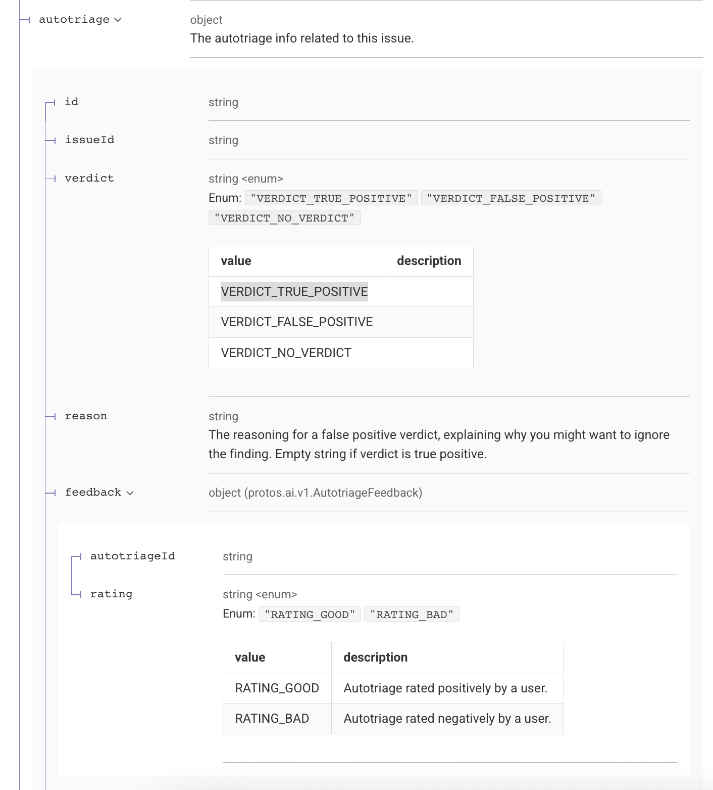

Lets now add a new feature to add AI Assistant metadata from the API to the SARIF output

To get the AI Assistant metadata we can use the Semgrep V2 FIndings- This data will already when we call the Semgrep V2 API using the function: get_finding_details

A finding can be either True_Positive or False_Positive, this is in the `autotriage` object in the `verdict` - which can be either VERDICT_TRUE_POSITIVE or VERDICT_FALSE_POSITIVE as shown in the screenshot 

IMPORTANT NOTE: we will use the AI assistant analysis provided by the Semgrep API V2  as shown above - do NOT use any other provider or do seperate AI analysis using OPENAI or Claude

If issue / finding is a VERDICT_FALSE_POSITIVE, we should Use suppressions (as defined in the SARIF)
The suppressions array within a result object is specifically designed for this purpose. Here's the optimal structure:
json{
  "results": [{
    "ruleId": "SQL-001",
    "message": {
      "text": "Potential SQL injection vulnerability"
    },
    "suppressions": [{
      "kind": "inSource",  // or "external" for scanner determination
      "state": "accepted",
      "justification": {
        "text": "False positive: Input is sanitized by the ORM framework's parameterized query builder on line 42"
      }
    }]
  }]
}

The "justification" is mapped to "Reason"

If the issue / finding is a VERDICT_TRUE_POSITIVE= For True Positives: Use kind and properties
For confirmed true positives, use:
json{
  "results": [{
    "ruleId": "XSS-001",
    "kind": "fail",  // Explicitly marks as a true finding
    "level": "error",
    "message": {
      "text": "Cross-site scripting vulnerability detected"
    },
    "properties": {
      "verificationStatus": "truePositive",
      "verificationReason": "User input directly rendered without encoding"
    }
  }]
}

ALso, the fix recommendation should be mapped to "fixes" as defined in @specs/EXAMPLE_GOOD_SARIF_JAVASPRINGVULNY.sarif.json (lines - 62 to 88)

                    "fixes": [
                        {
                            "artifactChanges": [
                                {
                                    "artifactLocation": {
                                        "uri": "Dockerfile"
                                    },
                                    "replacements": [
                                        {
                                            "deletedRegion": {
                                                "endColumn": 99,
                                                "endLine": 17,
                                                "startColumn": 1,
                                                "startLine": 17
                                            },
                                            "insertedContent": {
                                                "text": "USER non-root\nCMD [\"java\", \"-Djava.security.egd=file:/dev/./urandom\", \"-jar\", \"/app/java-spring-vuly-0.2.0.jar\"]"
                                            }
                                        }
                                    ]
                                }
                            ],
                            "description": {
                                "text": "By not specifying a USER, a program in the container may run as 'root'. This is a security hazard. If an attacker can control a process running as root, they may have control over the container. Ensure that the last USER in a Dockerfile is a USER other than 'root'.\n Autofix: Semgrep rule suggested fix"
                            }
                        }
                    ],
